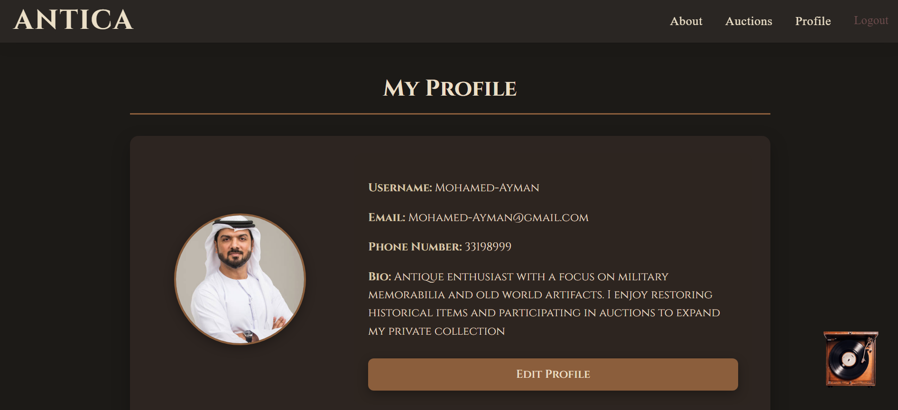

# ANTICA

## Date: 20/11/2025

### By: Balqees Alawi

#### GitHub: [balqeesalawi](https://github.com/balqeesalawi)

---

### **_Description_**

Antica is the premier online marketplace for rare and vintage antiques, connecting collectors, enthusiasts, and sellers across Bahrain. Whether you’re looking to discover unique pieces or sell your treasures, Antica makes buying and selling antiques seamless and trustworthy.

- For Collectors & Buyers: Explore rare and vintage items, from furniture to collectibles, all in one place.
- For Sellers & Dealers: Reach passionate buyers quickly and safely, showcasing your antiques to the right audience.
- For Auction Enthusiasts: Participate in live auctions and get exclusive access to limited and valuable pieces.

---

### **_Technologies Used_**

- Git
  - GitHub
- VS code
  - HTML, CSS, JavaScript, Python
- Library
  - Django ASGI
- Database
  - PostgresDB

---

### **_Getting Started_**

#### You have first to sign in and if you don't have an account sign up, once you sign in you will be able to use every functionality on the website.

---

### **_Screenshots_**

#### ERD

---
#### [wireframe]()

---

#### [Trello]()

---
### ScreenShots

---
### **_Future Updates_**

- [ ] Payment
- [ ] 3d view for the items
- [ ] chat between users

---

### **_Credits_**

[github](https://github.com/SEB-X-Bahrain/class_wiki)
[w3schools](https://www.w3schools.com/)

#####

---

